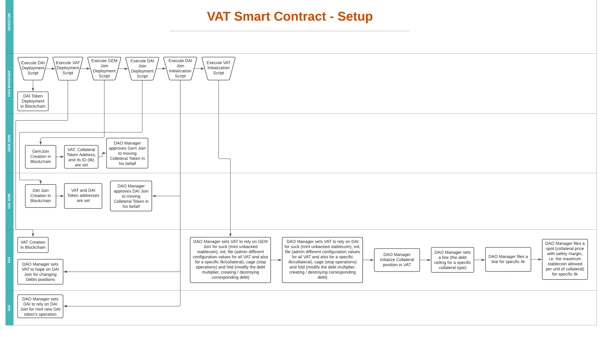
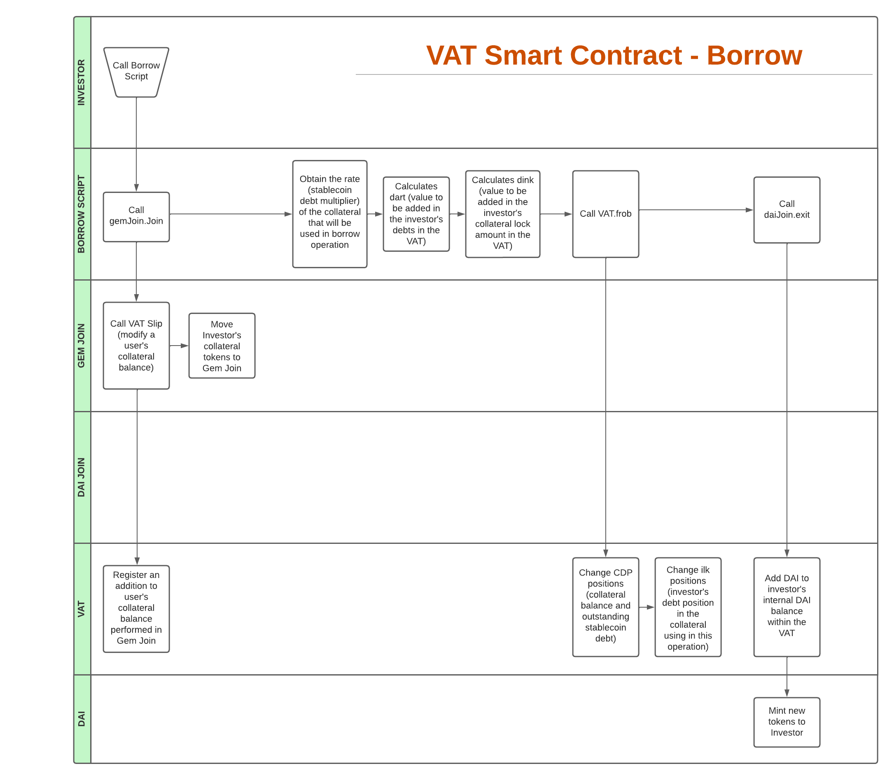
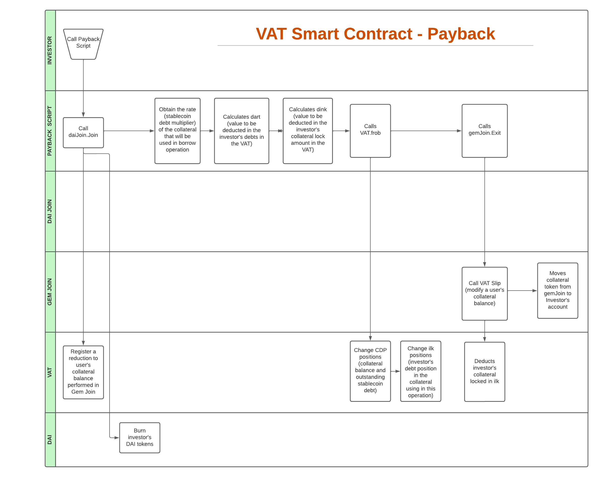

# Understanding Maker DAO VAT Smart Contract

Project to explain what is, how to setup, and interact with Maker DAO VAT Smart Contract.

The example projects are based on Foundry Forge Dewiz Template.

## Enviroment Setup

### Setup auxiliary tooling

Make sure you have **node.js**, **shfmt** and **foundry** installed.

### Install dependencies

```bash
# Install tools from the nodejs ecosystem: prettier, solhint, husky and lint-staged
make nodejs-deps
# Install smart contract dependencies through `foundry update`
make update
```

### Setup localchain using GETH

```bash
geth --datadir ~/temp/ --dev --http --http.api web3,eth,rpc,debug,net,txpool,admin --http.corsdomain "*" --http.vhosts "*" --http.addr 127.0.0.1 --ws --ws.api eth,net,debug,web3 --ws.addr 127.0.0.1 --ws.origins "*" --graphql --graphql.corsdomain "*" --graphql.vhosts "*" --vmdebug
```

### Setup local environment variables

```shell
export ETH_FROM=0x
export FOUNDRY_ETH_FROM=$ETH_FROM
export ETHERSCAN_API_KEY=""
export POLYGONSCAN_API_KEY=""
export ETH_KEYSTORE="/Users/johndoe/temp/keystore"
export FOUNDRY_ETH_KEYSTORE_DIR=$ETH_KEYSTORE
export ETH_PASSWORD="$ETH_KEYSTORE/passwd.txt"
export FOUNDRY_ETH_PASSWORD_FILE=$ETH_PASSWORD
```

### Helper scripts

Wrapper around `forge`/`cast` which figure out wallet and password automatically if you are using [`geth` keystore](https://geth.ethereum.org/docs/interface/managing-your-accounts).

- `scripts/forge-deploy.sh`: Deploys a contract. Accepts the same options as [`forge create`](https://book.getfoundry.sh/reference/forge/forge-create.html)
- `scripts/forge-verify.sh`: Verifies a deployed contract. Accepts the same options as [`forge verify-contract`](https://book.getfoundry.sh/reference/forge/forge-verify-contract.html)
- `scripts/cast-send.sh`: Signs and publish a transaction. Accepts the same options as [`cast send`](https://book.getfoundry.sh/reference/cast/cast-send.html)

## Setup Process

The image bellow show us in a big picture the VAT setup



## Deploying artifacts

In order to run this project to understand the Maker DAO VAT Smart Contract and its operations you need to deploy it and other Smart Contracts configure them.
Below are for instructions deployment and example scripts that will help you to do it and most importantly to help you to understand why these artifacts
are needed.

Due changes in Solidity arithmetics from version 0.5.x to 0.8.x the Maker DAO's DSS Smart Contracts need to be compiled using 0.6.x version to avoid overflow
errors when `frob` method is called - you will see more details about it below. So, we split this example project in two. `Rome DAO` simulates Maker DAO very
close to what we have in mainnet and this project simulates an user operating it using the Solidity version 0.8.x

Hence, when you see `from Rome DAO` instruction below please use scripts saved in `Rome DAO` project. Its URL is https://github.com/dewiz-xyz/rome-dao

### Deploy your own "Dai" token `$DAI` from Rome DAO

Deploy an ERC-20 to simulate `DAI` tokens. It will be managed by the protocol, Rome DAO, that simulates Maker DAO mechanisms.

Example:

```bash
<rome-dao-path>./scripts/forge-script.sh ./src/dai.s.sol:DaiDeploy --fork-url=$RPC_URL --broadcast -vvvv
```

### Deploy `Vat` from Rome DAO

Deploy `Vat` from `vat.sol`. VAT is the main compoment of Maker DAO. It manages the DAI supply versus debts tokenized in different collaterals.

Example:

```bash
<rome-dao-path>./scripts/forge-script.sh ./src/vat.s.sol:VatDeploy --fork-url=$RPC_URL --broadcast -vvvv
```

### Deploy your ERC-20 token `$DENARIUS`

Deploy an ERC-20 that simulates a tokenized asset you want to be a collateral for Rome DAO's `DAI`.

Example:

```bash
./scripts/forge-script.sh ./src/Denarius.s.sol:DenariusDeploy --fork-url=$RPC_URL --broadcast -vvvv
```

### Deploy `GemJoin` from Rome DAO

Deploy a `GemJoin` contract from `join.sol` and allow it to spend your collateral. `GemJoin` holds your collateral and `Vat` Smart Contract use it to manage
them.

```solidity
GemJoin(address vat, bytes32 ilk, address gem);
denarius.approve(address(gemJoin), type(uint256).max);
```

Where:

- `vat`: `<vat_addr>`
- `ilk`: `'Denarius-A'`
- `gem`: `$DENARIUS` ERC20 token address

Example:

```bash
<rome-dao-path>./scripts/forge-script.sh ./src/GemJoin.s.sol:GemJoinDeploy --fork-url=$RPC_URL --broadcast -vvvv
```

### Deploy `DaiJoin` from Rome DAO

Deploy a `DaiJoin` contract from `join.sol`. `DaiJoin` holds `DAI` and `Vat` Smart Contract use it to manage them.

```solidity
DaiJoin(address vat, address dai)
```

Where:

- `vat_`: `<vat_addr>`
- `dai_`: `$DAI` ERC20 token address

Example:

```bash
<rome-dao-path>./scripts/forge-script.sh ./src/DaiJoin.s.sol:DaiJoinDeploy --fork-url=$RPC_URL --broadcast -vvvv
```

Then, using `Rome DAO` scripts for:

1. Allow `DaiJoin` to **mint** `$DAI`
2. Allow `DaiJoin` to **burn** `$DAI`
3. Give Hope (permission) to `DaiJoin` operates moves `$DAI` for you within `Vat`
4. Make `$DAI` to rely on `DaiJoin`

Example:

```bash
<rome-dao-path>./scripts/forge-script.sh ./src/DaiJoin.s.sol:DaiJoinReceiveAllowance --fork-url=$RPC_URL --broadcast -vvvv
```

### `Vat` initialization from Rome DAO

`Vat` needs to rely on (authorize) `GemJoin` and `DaiJoin` Smart Contracts, initialize it. Also it is needed to set the global debt ceiling, set collateral debt ceiling, and set the collateral price.

See the sample code below:

```solidity
vat.rely(<gem_join_addr>);
vat.rely(<dai_join_addr>);
vat.init(<bond-or-collateral-name>);
vat.file('Line', 1_000_000 * 10**45); // RAD: 45 decimals
vat.file('Denarius-A', 'line', 1_000_000 * 10**45); // RAD: 45 decimals
vat.file('Denarius-A', 'spot', 1 * 10**27) // RAY: 27 decimals
```

Example:

```bash
<rome-dao-path>./scripts/forge-script.sh ./src/vat.s.sol:VatInitialize --fork-url=$RPC_URL --broadcast -vvvv
```

### Detailed explanation about the debt/collateral definitions in `VAT`

#### Set the global debt ceiling using `Line` (with capital `L`)

```solidity
vat.file('Line', 1_000_000 * 10**45); // RAD: 45 decimals
```

#### Set collateral debt ceiling `line` (with lower `l`)

Pay attention that now you define a name for your collateral, in our case: `Denarius-A`. The collateral data is stored within a struct called `ilk`. There is a
mapping called `ilks` that allow the `Vat` supports several collaterals with different rate configurations.

```solidity
vat.file('Denarius-A', 'line', 1_000_000 * 10**45); // RAD: 45 decimals
```

#### Set collateral price (`spot`)

Spot defines the collateral price within the `Vat`

```solidity
vat.file('Denarius-A', 'spot', 1 * 10**27) // RAY: 27 decimals
```

In the above example, it makes `$DENARIUS` price equals `DAI` price ( 1 to 1 ).

## Borrow `$DAI` using `$DENARIUS`

The image bellow describe in a spreadsheet with numbers the operation we are going to do:


This other image describe the flow performed in Solidity code to borrow DAI from the DAO:



### Add your `$DENARIUS` to the protocol by calling `GemJoin.join()`

```solidity
gemJoin.join(<your_addr>, <amount>); // <amount> with 10**18 precision
```

This will add collateral to the system, but it will remain **unemcumbered** (not locked). The next step is to draw internal `dai` from the `Vat` using `frob()`:

```solidity
   vat.frob(
       'Denarius-A', // ilk
       <your_wallet>,
       <your_wallet>,
       <your_wallet>, // To keep it simple, use your address for both `u`, `v` and `w`
       int dink, // with 10**18 precision
       int dart // with 10**18 precision
   )
```

- `dink`: how much collateral to lock(+ add ) or unlock(- sub) within `Vat`. It means the collateral is now **encumbered** (locked) into the system.
- `dart`: how much **normalized debt** to add(+)/remove(-). Remembering `debt = ilk.rate * urn.art` . To get the value for `dart`, divide the desired amount
  by `ilk.rate` (this is a floating point division, which can be tricky). See the [RwaUrn](https://github.com/makerdao/rwa-toolkit/blob/8d30ed2cb657641253d45b57c894613e26b4ae1b/src/urns/RwaUrn.sol#L156-L178) component to understand how it can be done
- Recommendation: to leave `dink = dart*2` when calling `vat.frob` for drawing to make the collateralization rate in 200%.

### Get ERC-20 `$DAI`

Now it is a great time. Calling the method below after `vat.frob` you are allowed to receive `$DAI` in your wallet.

```solidity
daiJoin.exit(<your_wallet>, <amount>); // <amount> with 10**18 precision
```

Example:

```bash
./scripts/forge-script.sh ./src/Operation.s.sol:Borrow --fork-url=$RPC_URL --broadcast -vvvv
```

### Status Information about your Positions in `Dai`, `$DENARIUS` and within the Rome DAO (simulating Maker) protocol

To know what is your actual positions in `Dai`, `$DENARIUS` and within the Rome DAO (simulating Maker) protocol there is a helper script that gives you
these information reading the different smart contracts of the Protocol. Just call:

```bash
./scripts/forge-script.sh ./src/Operation.s.sol:InfoBalances --fork-url=$RPC_URL --broadcast -vvvv
```

## Repay your loan to get `$DENARIUS` back

This image below describe the flow performed in Solidity code to payback DAI to the DAO:



### Add your `$DAI` to the protocol by calling `DaiJoin.join()`:

```solidity
daiJoin.join(<your_addr>, <amount>); // <amount> with 10**18 precision
```

This will burn ERC-20 `$DAI` and add it to `<your_addr>` internal balance on the `Vat`.

### Repay internal `dai` in the `Vat` using `frob()`:

```solidity
vat.frob(
      'Denarius-A', // ilk
      <your_wallet>,
      <your_wallet>,
      <your_wallet>, // To keep it simple, use your address for both `u`, `v` and `w`
      int dink, // with 10**18 precision
      int dart // with 10**18 precision
)
```

- `dink`: how much collateral to unlock. **MUST BE NEGATIVE**. Collateral is now **uncumbered** (unlocked), but still in the system.
- `dart`: how much **normalized debt** to remove. **MUST BE NEGATIVE**. Remember that `debt = ilk.rate * urn.art` . To get the value for `dart`, divide the desired amount by `ilk.rate` (this is a floating point division, which can be tricky)
- See the [RwaUrn](https://github.com/makerdao/rwa-toolkit/blob/8d30ed2cb657641253d45b57c894613e26b4ae1b/src/urns/RwaUrn.sol#L156-L178) component to understand how it can be done

### Get your `$DENARIUS` back:

```solidity
gemJoin.exit(<your_wallet>, <amount>); // <amount> with 10**18 precision
```

Example:

```bash
./scripts/forge-script.sh ./src/Operation.s.sol:PayBack --fork-url=$RPC_URL --broadcast -vvvv
```

## Summary

All the steps above have described how Maker DAO protocol manages DAI supply and its collaterals.
